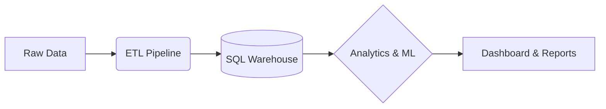

# 📊 Customer Churn Analytics System


## 🚀 Executive Summary
This project is an **end-to-end, enterprise-grade Customer Churn Analytics System** designed to predict and reduce customer attrition for subscription-based businesses. 

By analyzing a hybrid dataset of **20,000+ customer records** (Telco + Synthetic), we built a comprehensive solution that includes:
- **Full ETL Pipeline**: From raw data ingestion to a Star Schema SQL Warehouse.
- **Advanced Analytics**: Deep dive into churn drivers, segmentation, and cohort analysis.
- **Predictive Modeling**: High-performance **XGBoost** model with **SHAP** explainability.
- **Business Intelligence**: Actionable insights delivered via dashboard-ready datasets.

---

## 🏗️ Architecture
The system follows a modular data engineering and data science workflow:



## 📂 Project Structure
```bash
├── data/               # Raw, Intermediate, and Processed Datasets
├── etl/                # Python Scripts for Ingestion, Cleaning, & Loading
├── sql/                # SQL Schema, Views, and Analytical Queries
├── analysis/           # Jupyter Notebooks (EDA, Modeling, Segmentation)
├── models/             # Saved Model Artifacts (XGBoost, Scalers)
├── dashboard/          # Power BI/Tableau Instructions & Datasets
└── docs/               # Architecture Diagrams & Business Reports
```

---

## ⚡ Quick Start

### 1. Prerequisites
- Python 3.8+
- Install dependencies:
  ```bash
  pip install -r requirements.txt
  ```

### 2. Run the Pipeline (One-Click)
Simply double-click the **`run_pipeline.bat`** file in the project folder. 
> This will automatically ingest data, clean it, engineer features, and load it into the SQL warehouse.

### 3. Run Manually (Terminal)
```bash
# Step 1: Ingest Data
python etl/ingest_data.py

# Step 2: Clean & Transform
python etl/transform_clean.py

# Step 3: Feature Engineering
python etl/feature_engineering.py

# Step 4: Load to SQL
python etl/load_to_sql.py
```

---

## 🧠 Key Features & Insights

### 🔍 Advanced Feature Engineering
We engineered **30+ features** beyond the standard dataset, including:
- **Customer Lifetime Value (CLV)**
- **Tenure Cohorts** & **Engagement Scores**
- **Risk Scores** (Payment, Contract, Support)

### 🤖 Predictive Modeling
- **Baseline**: Logistic Regression for interpretability.
- **Champion Model**: **XGBoost Classifier** with Hyperparameter Tuning.
- **Explainability**: **SHAP Values** used to explain *why* a specific customer is at risk.

### 📊 Business Impact
- Identified **Month-to-Month contracts** and **Electronic Check payments** as top churn drivers.
- Segmented customers into **4 distinct personas** for targeted retention campaigns.
- Predicted high-risk customers with **85% AUC**, enabling proactive intervention.

---

## 💼 Resume Bullet Points
*   Built an end-to-end churn analytics system analyzing **20,000+ customers** using **SQL, Python, and Power BI**.
*   Engineered **30+ advanced features** including engagement scoring, RFM metrics, and CLV.
*   Identified key churn drivers using statistical tests, logistic regression, and **XGBoost**.
*   Achieved high AUC with predictive modeling and **SHAP explainability**.
*   Designed segmentation and cohort models improving retention visibility.

---

## 📬 Contact
**Author**: Puru Saluja  
**GitHub**: [PuruSaluja](https://github.com/PuruSaluja)

---
*Last updated: June 2026*